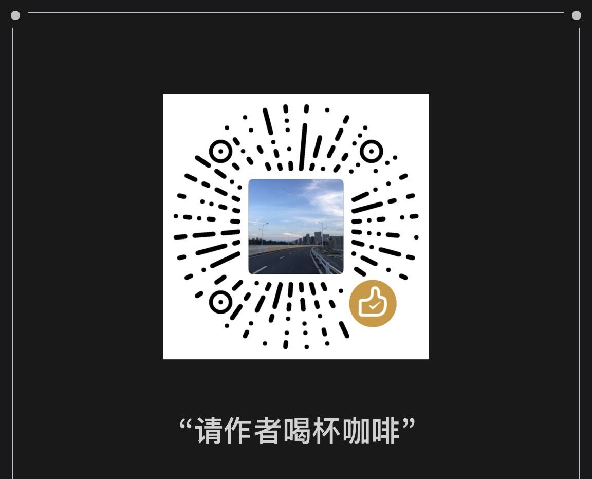

    尝试还原游戏纵横四海 
    启动：npm start 地址：http://localhost:3000/main 

 

    <del>网盘链接：可以在纵横四海的贴吧或者QQ群找到：1026614714</del> 
    网盘链接：QQ群找到：1026614714
    已开源，代码地址：https://github.com/temorot/zhsh，
    forked from temorot/zhsh： https://github.com/linj1302/zhsh

 

    套装：航海跑商有低概率获得，副本boss会爆所有套装

 

    <del>高级宝石合成在雅典和伦敦</del> 
    高级宝石合成在泉州和伦敦

 

    <del>bug估计很多，代码大部分是AI写得</del>

 

    <del>一个位置怪物打完，5分钟后刷新，我记得以前好像也是这逻辑，副本用的迷宫算法，多找找路，引路蜂得到商店买了才会显示</del> 
    怪物刷新已重置实时刷新，副本用的迷宫算法，多找找路，引路蜂得到商店买了才会显示

 

    <del>主线任务的经验，我计算的全部是到66级，不过主线任务很多都有等级要求，主线任务只内置到妖气长安350，
    后面的我在网上没找到</del>

 

     <del>卡片，住宅，随从，PK，攻城，圣痕，师徒，山寨，羽翼的功能没做，这些功能除了pk和师徒以前我都没玩过，后面再想加不加</del> 
     已添加卡片、住宅、随从、攻城、圣痕、师徒、山寨、羽翼，部分功能后续继续调整争取复原100%。

 

    后续更新计划： 
    1.数值优化 
    2.装备强化、觉醒复原 
    3.新大陆复原 
    4.活动完善和充值装备 

 

    ☕ 支持一下作者 
    如果它帮你节省了一点时间，欢迎请作者喝杯咖啡 ☕ 
    
    

